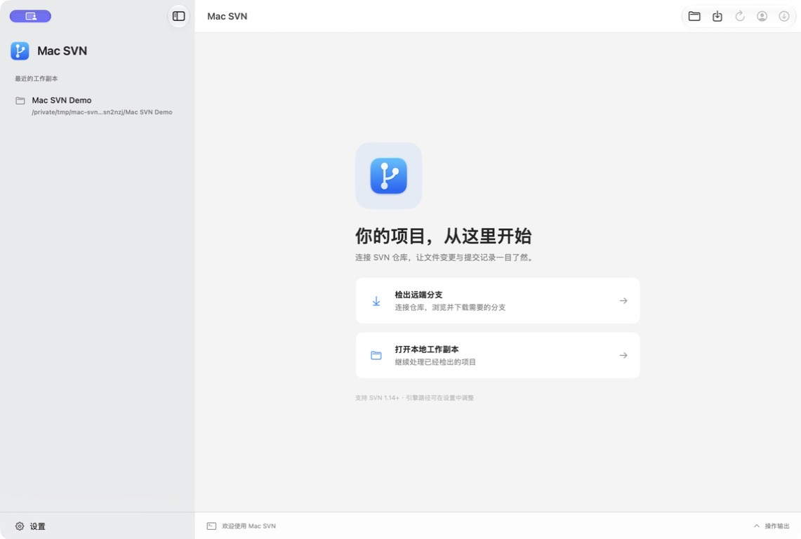
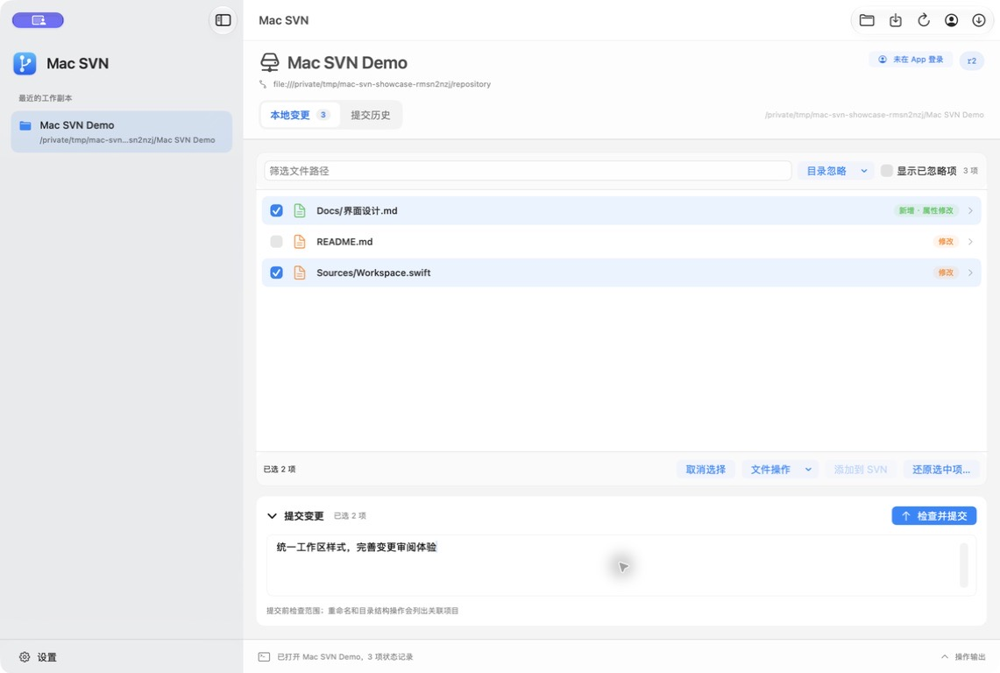
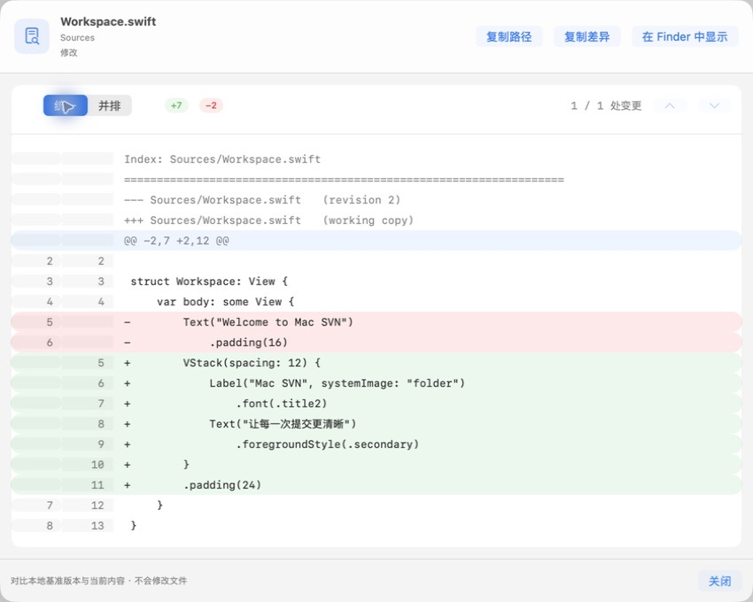
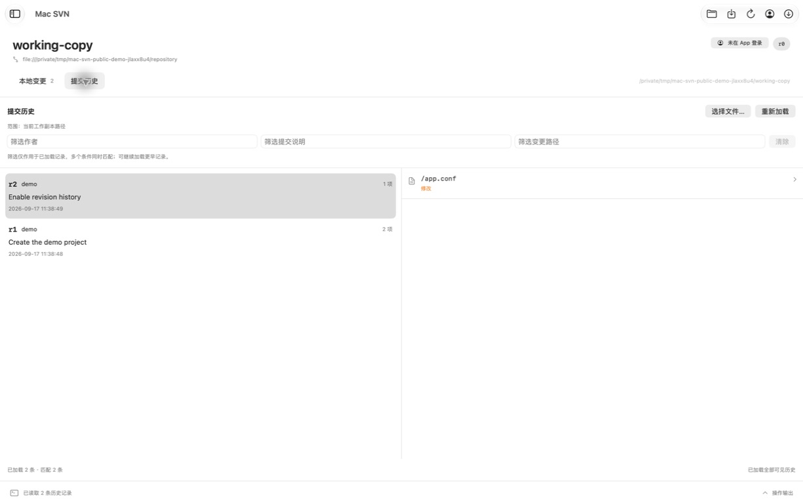

# Mac SVN

[简体中文](#简体中文) · [English](#english) · [MIT License](LICENSE) · [下载 / Download](https://github.com/codeowls/mac-svn/releases/latest)

A native macOS Subversion client built with SwiftUI. Review changes, browse history, and commit selected files.

使用 SwiftUI 构建的 macOS 原生 SVN 客户端，让日常变更审阅、历史查询和选择性提交更直观。

## 界面预览 / Screenshots

以下为原应用的真实截图，仅使用本地演示仓库和 `demo` 作者；侧栏仅展示演示工作副本，未展示业务地址、账号或个人目录。应用支持简体中文和英文，可在设置中切换，重启后生效。

Real screenshots of the app using a local demo repository and the author `demo`. The sidebar shows only the demo working copy; no business server addresses, accounts, or personal directories are shown. The app supports Simplified Chinese and English; change the language in Settings and restart.

### 欢迎页 / Welcome



### 工作区与选择性提交 / Working copy and selective commits



### 文件差异 / File diff



### 提交历史 / Revision history



## 简体中文

当前版本为 **1.3.0**，面向日常 SVN 工作副本管理。源码采用 MIT 协议；应用尚未完成正式签名、公证和跨设备兼容性验证。

## 下载与安装

前往 [GitHub Releases](https://github.com/codeowls/mac-svn/releases/latest) 下载，或直接选择 **1.3.0** 安装包：

- [DMG 安装包（推荐）](https://github.com/codeowls/mac-svn/releases/download/v1.3.0/Mac-SVN-1.3.0-universal.dmg)：打开后将 **Mac SVN.app** 拖入 **Applications（应用程序）**。

安装包要求 **macOS 14+**，同时包含 **Apple Silicon / Intel** 架构，无需安装 Swift 或 Xcode。已在 Apple Silicon 验收；Intel 已完成构建，尚未进行 Intel 实机验收。App 仍需本机 **Subversion 1.14+**；已安装 Homebrew 时运行 `brew install subversion`，启动后可在设置中检测或指定 SVN 路径。应用支持简体中文和英文，可在设置中切换，重启后生效。

**签名说明：**本版为 ad-hoc 签名，尚无 Developer ID 签名和 Apple 公证，macOS 可能阻止首次打开。请先核对下载来源，再参考 [Apple 官方打开指引](https://support.apple.com/102445)。无需关闭系统 Gatekeeper。

## 从源码运行

- macOS 14 或更新版本；当前在 Apple Silicon 上开发验证。
- Swift 6+ / 对应的 Xcode Command Line Tools。
- 本机 Subversion 1.14+，创建本地演示仓库还需要 `svnadmin`。

```bash
brew install subversion
swift run MacSVN
```

也可以使用 Xcode 打开 `Package.swift`。默认检测 `/opt/homebrew/bin/svn`、`/usr/local/bin/svn`、`/usr/bin/svn`，其他位置可在 App 设置中指定。

## 打包 App

```bash
bash scripts/build-app.sh
open "dist/Mac SVN.app"
```

默认生成本机架构 App；使用 `bash scripts/build-app.sh --universal` 可生成通用架构。版本号统一读取 `VERSION`，采用 ad-hoc 签名，尚未进行 Developer ID 签名和 Apple 公证。构建产物不会提交到 Git。

构建脚本默认将 SwiftPM 并行任务数和编译器线程数均设为 2，以降低本机负载；这不是严格的 CPU 占用上限。可用 `SWIFT_BUILD_JOBS=1 bash scripts/build-app.sh` 进一步降低并发，或按需增加该正整数。通用包的两个架构依次构建，`package-release.sh` 也沿用此设置。正式安装包可由下述 GitHub Actions 发布流程构建，无需在本机重复打包。

运行 `bash scripts/package-release.sh` 生成通用架构 DMG 和本地 SHA256 校验文件，输出到 `dist/releases/1.3.0/`；已有同版本输出时拒绝覆盖。维护者更新 `VERSION` 及 `release-notes/<版本>.txt` 后推送对应 `v<版本>` 标签，发布工作流会校验标签、构建验证安装包、上传附件后公开 Release。

打包时自动生成并嵌入原生 App 图标；源图和图标说明位于 [`assets/`](assets/README.md)。通过打包后的 `.app` 启动可使用该图标。打包脚本会刷新该 App 的 Launch Services 注册，启动时重新载入 Dock 图标；重建后请退出旧进程再打开 `dist/Mac SVN.app`。`swift run` 是裸可执行文件调试入口，不包含 `.app` 的图标和语言声明。

打包的 App 已声明简体中文，系统文件选择器会使用中文侧栏和按钮，不修改系统语言偏好。

工具栏和分栏使用系统原生外观。要采用 Liquid Glass，请使用包含 macOS 26 或更新 SDK 的工具链打包，并在 macOS 26 或更新系统运行；最低运行要求仍为 macOS 14。打包脚本会将实际 SDK 版本写入链接信息，避免被误标为最低系统版本。当前 CI 使用 Xcode 16.4，仅验证原有系统兼容构建，不代表 Liquid Glass 外观验收。

## 访达集成

1.3.0 安装包包含访达扩展，可从右键菜单提交所选项目、确认更新整个工作副本、查看差异和历史。请在“设置 → 访达”启用扩展并添加当前工作副本。详见[启用步骤与操作范围](docs/FINDER.md)。

## 当前功能

- 统一的原生工作台样式；在“显示 → 外观”选择跟随系统、浅色或深色，仅影响此应用。
- 提交说明可折叠，首次勾选自动展开；折叠保留会话草稿。紧凑列表显示文件类型与状态标签。
- 历史详情完整显示提交说明、作者和时间；文件名与目录分层显示，支持复制完整路径，差异底部精简为版本范围。

- 设置中支持选择 SVN 可执行文件、自动检测常见安装位置及测试版本；保存前检查 SVN 1.14+，编辑草稿不会提前改变当前配置。
- 切换工作副本时，在当前 App 会话内分别保留提交说明、路径筛选、已选项目、显示忽略项开关及历史查询范围／筛选；返回副本时重新核对状态，已提交或已忽略项目不会恢复为选中。提交成功清空对应草稿，移除最近记录会丢弃该副本草稿，退出 App 后草稿不保留。
- 支持仅对本应用生效的全局忽略列表，保存后刷新当前副本并在重启后保留；可切回系统 SVN 配置。状态列表支持显示已忽略项，忽略项不能勾选添加或提交。
- 打开已有工作副本，保存最近打开记录；已有记录切换时保持原位，新副本加入顶部；右键记录并选择“删除…”后，弹窗显示完整路径；确认“移除记录”才从列表移除，取消不改变记录。移除结果在重启后仍生效，不删除磁盘文件。移除当前副本或清空列表时，清空工作区并返回欢迎页；移除其他记录不影响当前工作区。从子目录打开时定位到工作副本根目录。
- 直接输入远端分支 URL 检出，或逐层浏览仓库目录、进入所需分支后检出到新目录；支持标准及自定义分支布局。
- 仓库地址输入框旁支持历史下拉选择；成功登录、浏览、检出或打开工作副本后保存地址，去重并保留最近 12 项。重新打开检出窗口默认填入最近地址，重启 App 后仍保留。
- 在检出窗口或工具栏的“仓库账号”中输入账号、密码，验证通过后用于该仓库的浏览、检出、更新、历史和提交；支持切换账号，密码只保留在当前 App 会话。
- 查看、筛选本地状态，识别内容修改、属性修改、缺失文件、文本及树冲突。
- 点击文件弹出差异视图，主界面不常驻差异面板；支持统一／并排切换、新旧行号、增删统计、变更段跳转、复制原始差异及 Finder 定位。属性和二进制提示保留 SVN 原文。
- “未纳入版本控制”表示项目仅存在于本地，尚未加入 SVN；点击可查看说明，不自动添加或上传。
- 将未跟踪文件或目录添加到版本控制；添加目录时不递归添加子项。
- 勾选文件、填写说明、检查清单后提交；提交前重新校验状态。
- 点击冲突项目查看类型、操作、原基准／传入版本及真实辅助文件；内容冲突可用默认编辑器打开工作文件，保存后重新读取并检查最终内容。明确确认后才采用当前文件标记解决，确认期间内容或冲突状态变化会拒绝执行；完成后重新读取 SVN 状态，仍需单独提交。属性和树冲突仅提供详情，需用 SVN 命令行或专用工具处理。
- 支持外部三方合并入口：在“设置 → 合并工具”选择工具并保存安装路径，再从冲突详情打开。提供 IntelliJ IDEA、VS Code、Beyond Compare、Kaleidoscope、KDiff3、FileMerge 的命令行预设；IDEA 已实测启动、取消及保存，其他预设尚待各工具实机验收。工具需自行安装，FileMerge 需要完整 Xcode。启动前重新核对冲突和四个文件，工具退出不会自动解决或提交；保存并关闭合并窗口后，返回检查最终内容并确认。日常差异查看仍使用内置视图。
- 更新工作副本，产生冲突时保留冲突供后续处理。更新与提交自动展开真实 SVN 输出，显示耗时及进行中／完成／失败／取消状态；失败或取消保留日志，提交结果不明时提示先核实历史。
- 支持文件和目录的 SVN 重命名、删除：变更项右键操作，或通过“文件操作”选择未修改的项目。操作前列出完整影响范围；目录删除包含其中的未提交修改、未受控和已忽略文件。确认期间内容、属性或范围变化会拒绝执行；嵌套副本和冲突需先单独处理。重命名保留已有历史关联，删除／重命名不自动提交。
- 选中项目后可还原，执行前展示目标、实际差异及影响，明确确认后才丢弃修改。确认时重新核对状态、属性和内容（含二进制），发生变化则拒绝执行；还原后重新读取状态。普通新增文件撤销新增安排但保留本地内容，带历史复制文件会被删除。
- 分页查看提交历史，每次加载 50 条，可继续加载更早记录；按作者、提交说明和变更路径组合筛选，明确仅筛选已加载记录。续读失败或取消时保留已有记录，可重试。
- 支持在历史页选择已提交的文件，或右键本地变更项查看该路径历史；可返回工作副本历史，重载及登录重试保持当前查询范围。选中提交后显示该次提交的变更文件／目录列表，区分新增、修改、删除、替换和复制来源。路径按仓库根目录显示，以服务器返回的授权范围为准。
- 点击历史变更列表中的文件／目录整行可查看对应提交的差异；行尾箭头及悬停高亮提示可点击，标注两端路径与版本；新增、删除、替换按前后版本比较，新增复制按复制来源版本比较。复用统一／并排视图；Word 等二进制文件显示中文能力提示，隐藏无效的展示切换，原始诊断及属性变更可在“技术详情”中展开。读取失败可重试；不会使用或改动本地未提交内容。
- 历史文件支持分别导出前／后版本，保留原始二进制内容及文件扩展名；新增和删除只提供存在的一端，带历史新增可导出复制来源，替换保留被替换的前版本。保存位置需在当前工作副本以外；读取失败或取消不写入目标文件。目录不能作为单文件导出，导出不包含 SVN 属性。
- 历史读取失败与空历史分别显示；认证失败可直接登录仓库，登录成功后重新读取历史。工作区标题显示当前仓库的 App 登录账号；未登录时仍允许使用本机 SVN 已有认证配置。
- 查看操作输出和错误信息，原始历史查询诊断保留在操作输出中；支持中断进行中的命令。高频日志每 100 毫秒合并刷新，结束前排空；滚动文本视图增量追加完整内容，支持暂停跟随和复制完整输出。
- 检出失败或取消后保留日志并检查目标目录，区分尚未创建、空目录、普通非空目录及可识别的工作副本；显示不完整／缺失／阻塞、冲突和工作副本锁提示，可重新检查、在访达中定位或打开副本。检查不自动清理、删除或重试下载；本地状态正常也不代表检出完整，打开后需手动更新核实。
- 检出时自动展开实时日志，显示已完成项目数（文件/目录）、最近完成路径及耗时；等待新输出时明确提示。大文件传输期间 SVN 可能暂时没有新通知，不显示推算百分比。失败显示 SVN 原始错误和输出，取消保留已收到的日志。

## 使用流程

1. 点击“检出远端”，输入仓库 URL 并“浏览仓库”，逐层进入需要的分支（例如 `branches/release-0.2`）；选择或新建本地空文件夹，再点击“开始检出”。仓库内容直接检出到所选目录，无须另外填写文件夹名称。未填写地址或选择目录时会显示不可用原因。已知完整分支 URL 时可以直接检出，无须先浏览。检出默认递归包含当前地址下的所有子目录和文件，不包含 externals 外部引用。非空目录不会被覆盖，已有本地项目用“打开本地工作副本”。
2. 点击文件查看差异，使用复选框选择要操作的项目。
3. 未跟踪项目先点“添加到 SVN”，再填写说明并“检查并提交”。新增目录先添加目录，再选择需要的子文件；提交新文件时需包含尚未提交的父目录。
4. “更新”从服务器获取变更；“刷新”只重新读取本地状态。“历史记录”需要访问服务器。
5. 历史页的“加载更早记录”继续读取下一页；作者、说明、路径三个筛选条件同时匹配，不区分大小写。筛选没有结果时仍可加载更早记录。点击“选择文件…”可查看当前副本内干净文件的历史；变更项右键“查看此路径历史”也支持目录。单路径查询只返回涉及该路径的提交，右侧明细仍展示整次提交的授权变更项。嵌套工作副本和 externals 需单独打开；未受控及尚未提交的新增项目没有本地仓库历史入口。

SVN 没有 Git 暂存区；复选框用于选择本次提交、添加或还原的目标。提交前读取实际范围：普通目录不包含未选子项；重命名两端、未提交的父目录，以及目录删除／替换／带历史复制涉及的子项会完整列入确认清单，逐项说明原因。目录替换同时列出被移除的原 BASE 子项。确认时再次核对内容（含二进制）、属性、状态及范围，变化时要求重新检查；不会静默扩大提交范围。

## SVN 设置与忽略规则

在侧栏点击“设置”，可切换“设置”和“忽略”两页。当前使用本机 SVN，不提供内置引擎选择，也不需要额外的库／SSH 文件访问路径列表。

- “设置”页可手动输入路径、选择可执行文件、自动检测或测试版本。测试不连接仓库；无效文件和低于 1.14 的版本不能保存。
- “忽略”页默认沿用本机 SVN 配置。勾选“使用自定义全局忽略列表（仅此应用）”后编辑规则并保存，即可覆盖本应用调用 SVN 时的全局列表，不修改 `~/.subversion/config` 或工作副本属性。
- 规则是文件或目录名称的通配符，以空格、换行或其他空白分隔。保存时去重并统一分隔；`#*#` 是模式，不是注释。不支持 `.gitignore` 的路径、否定和注释语法。
- “填入常用规则”包含常见编译／编辑器临时文件，以及 `.DS_Store`、`.idea`、`*.iml`。`.iml` 只匹配同名项目，匹配所有该后缀文件应写 `*.iml`；SVN 自身管理 `.svn`，无须添加该规则。
- 自定义列表留空表示禁用全局模式；目录的 `svn:ignore`、继承的 `svn:global-ignores` 仍有效。取消自定义则恢复使用系统配置。
- 忽略仅影响未受控项目，不删除文件，不隐藏已受控文件的修改，也不会阻止检出或更新仓库中已受控的文件。添加前重新核对状态，避免旧选择绕过新的忽略规则。
- 主列表的“显示已忽略项”仅控制查看，忽略项显示说明且不能勾选。
- “目录忽略”菜单可编辑工作副本根目录或选择其他受控目录。未受控项目右键可按名称或文件扩展名预填规则，保存前可编辑或取消；其他状态项右键可编辑所在目录的规则。
- 目录规则写入 `svn:ignore`，每行一个名称或通配符，保留名称中的空格；只作用于该目录的直接子项，不递归修改子目录。按名称添加时自动转义 `*`、`?` 等字符，避免扩大匹配范围。保存后显示目录属性变更，需要单独提交目录才会共享。详见 [SVN 目录忽略说明](https://svnbook.red-bean.com/en/1.8/svn.advanced.props.special.ignore.html)。
- 删除规则行并保存可撤销该规则；清空并保存会移除当前目录的 `svn:ignore` 属性。全局配置和祖先的 `svn:global-ignores` 仍有效，其他属性与本地文件不受影响。保存前重新核对原属性，编辑期间规则改变则拒绝覆盖；嵌套副本、冲突及无效目录需单独处理。

可以先创建一个带真实变更的本地演示仓库，熟悉界面，不需要连接任何业务服务器：

```bash
bash scripts/create-demo.sh
```

脚本输出可打开的工作副本路径，演示数据保留在临时目录中，不自动删除。

## 认证与已知边界

- 私有仓库可直接通过“仓库账号”登录，支持 `http://`、`https://` 和 `svn://`。登录仅验证读取权限，写权限由提交时的服务器授权检查决定；失败不会自动重试提交。`file://` 不需要登录，`svn+ssh://` 继续使用系统 SSH 认证。
- App 中输入的密码仅保留在本次会话，按验证成功的仓库根路径隔离；关闭 App 后需重新登录。密码通过标准输入传递，不放入进程参数、不写入 UserDefaults 或 SVN 认证缓存。未在 App 登录的仓库仍使用本机 SVN 已配置的认证缓存、代理和证书。
- 所有命令使用 `--non-interactive`，不静默信任证书；URL 不允许包含密码。显式登录使用 SVN 1.14+ 的 `--password-from-stdin`。
- 尚未内置 SVN 引擎、文件状态角标、三方合并编辑器或文件锁管理。
- 检出、状态扫描和更新使用 `--ignore-externals`；外部工作副本需单独打开管理。
- 还原暂不支持冲突、移动两端，以及删除／缺失／替换／带历史复制的目录。目录属性只还原自身，不递归处理子项；普通新增目录必须同时选中其已受控子项。
- 同一窗口内写操作串行执行；不要与终端或其他客户端同时修改同一个工作副本。
- 取消不代表回滚。检出失败/取消可能留下部分目录，需检查或手动处理后再检出；App 不自动删除目录。提交失败或取消后先核实历史，不能假定服务器一定没有提交成功。
- Diff 基于 SVN 统一差异按行展示，尚不包含语法或词内高亮，也不提供冲突合并编辑；超大文件的解析和渲染仍需专项验证。
- 最近目录与 SVN 可执行文件设置保存在本机 UserDefaults，不进入代码仓库。

## 构建检查

```bash
swift build
```

CI 配置位于 `.github/workflows/ci.yml`，在 macOS 15 / Xcode 16.4 上安装 SVN，运行 Release 打包和本地签名检查。每次推送及 Pull Request 的检查结果见 GitHub Actions，日常 CI 不发布版本；`.github/workflows/release.yml` 仅在版本标签推送时生成并发布安装包。自动测试覆盖访达请求校验、目录配置、真实隔离仓库的选择提交和历史分页，可运行 `bash scripts/test.sh`。

## 代码结构

```text
Sources/SVNCore/       SVN 进程执行、XML 解析、状态模型与业务操作
Sources/MacSVN/        SwiftUI 界面与主线程状态管理
scripts/build-app.sh  本地 .app 打包
```

## 开源协议

本项目采用 [MIT License](LICENSE)，版权署名为 `codeowls`。分发时请保留许可证及版权声明。Subversion、Swift 和系统框架分别遵循各自的许可条款。

---

## English

**Version 1.3.0.** Mac SVN is a native SwiftUI client for everyday Subversion work. Source code is available under the MIT License. The app has not yet completed release signing, notarization, or cross-device compatibility validation.

### Download and install

Visit [GitHub Releases](https://github.com/codeowls/mac-svn/releases/latest), or download **1.3.0** directly:

- [DMG installer (recommended)](https://github.com/codeowls/mac-svn/releases/download/v1.3.0/Mac-SVN-1.3.0-universal.dmg): open it and drag **Mac SVN.app** into **Applications**.

Requires **macOS 14+** and local **Subversion 1.14+**. Both **Apple Silicon and Intel** architectures are included; Swift/Xcode is not required. Apple Silicon runtime checks passed; Intel is built but has not been tested on physical Intel hardware. With Homebrew already installed, run `brew install subversion`; the SVN path can be selected in app Settings. The app interface is Simplified Chinese.

**Signing:** this release is ad-hoc signed, without Developer ID signing or Apple notarization. macOS may block its first launch. Verify the download source, then follow [Apple's official guidance](https://support.apple.com/102445). Do not disable Gatekeeper system-wide.

### Run from source

- macOS 14 or later; developed and verified on Apple Silicon.
- Swift 6+ with a compatible Xcode or Command Line Tools installation.
- Subversion 1.14+ installed locally. `svnadmin` is also needed to create the optional demo repository.
- The application supports Simplified Chinese and English. Choose a language in Settings and restart.

```bash
brew install subversion
swift run MacSVN
```

You can also open `Package.swift` in Xcode. Mac SVN checks `/opt/homebrew/bin/svn`, `/usr/local/bin/svn`, and `/usr/bin/svn`; a different executable can be selected in Settings.

### Build the macOS app

```bash
bash scripts/build-app.sh
open "dist/Mac SVN.app"
```

The script builds for the local architecture, embeds the app icon and language declarations, and applies an ad-hoc signature. It refreshes this app's Launch Services registration. Quit the previous app process before reopening the rebuilt bundle. Build artifacts are excluded from Git.

Build scripts default to 2 SwiftPM jobs and 2 compiler threads to reduce local load; this is not a strict CPU usage cap. Use `SWIFT_BUILD_JOBS=1 bash scripts/build-app.sh` to reduce concurrency further, or choose another positive integer. Universal builds process architectures sequentially, and `package-release.sh` inherits the same setting. The GitHub Actions release workflow can build distribution packages without repeating that work locally.

Use `bash scripts/build-app.sh --universal` for both architectures, or `bash scripts/package-release.sh` to produce DMG and local checksums in `dist/releases/1.3.0/`. Existing release output is not overwritten. The version comes from `VERSION`; packages use ad-hoc signing without Developer ID signing or Apple notarization. Running `swift run` starts a bare executable without the bundle's icon and language configuration.

Liquid Glass appearance requires a macOS 26+ SDK and macOS 26+ at runtime; the minimum deployment target remains macOS 14. The build script records the actual linked SDK. CI uses Xcode 16.4 and checks the compatibility build, not Liquid Glass appearance.

### Finder integration

Version 1.3.0 includes a Finder extension for selected commits, confirmed working-copy updates, diffs, and history. Enable it through **Settings → Finder** and add the current working copy. See [setup and operation scope](docs/FINDER.md).

### Features

- Consistent native workspace styling with System, Light, and Dark appearance options in the View menu.
- Collapsible commit messages preserve session drafts and expand when files are first selected. Compact file rows show type icons and status badges.
- Full revision details show the message, author, and date. File names and directories are separated; full paths can be copied and diff footers show concise revision ranges.

- Open existing working copies or browse a remote repository and check out a selected branch into a new or empty directory. Existing nonempty directories are not overwritten; externals are excluded.
- Keep recent working copies and repository addresses. Removing a recent entry requires confirmation and does not delete local files.
- Inspect conflict types, operations, base/incoming revisions, and actual conflict files. Open the working file in its default editor, review the saved result, and explicitly confirm before marking a file-content conflict resolved. Content or conflict changes after review require a new review. SVN status is read back; committing remains a separate action. Property and tree conflicts are read-only and require SVN or a dedicated tool.
- External three-way merging: choose a tool and save its installation path in Settings → Merge Tools, then launch it from conflict details. CLI presets cover IntelliJ IDEA, VS Code, Beyond Compare, Kaleidoscope, KDiff3, and FileMerge. IDEA launch, cancellation, and saving have been exercised; other presets still require acceptance with the respective applications. Install tools separately; FileMerge requires full Xcode. Conflict identity and all four files are rechecked before launch. Exiting the tool never resolves or commits automatically: save and close its merge window, then review and explicitly confirm in Mac SVN. Ordinary diffs continue to use the built-in viewer.
- Review and filter local changes, including content, properties, missing files, and conflicts. Unversioned files are clearly distinguished from versioned changes.
- Inspect unified or side-by-side text diffs with line numbers, change counts, and navigation between changed sections. Binary files, including Word documents, show an explicit limitation message with expandable original SVN diagnostics and property changes.
- Rename or delete files and directories through context menus or the File Operations picker. Review all affected paths before confirming; directory deletion includes modified, unversioned, and ignored contents. Changes after review require a new review. Nested working copies and conflicts need separate handling. Rename preserves existing history; neither operation commits automatically.
- Review commit scope, including required move counterparts, added parents, and descendants of structural directory operations. Ordinary directories do not include unselected children.
- Review the actual changes before reverting. State and content are checked again at confirmation. Ordinary newly added files remain on disk after reverting their addition; files added with history may be deleted by SVN revert.
- Browse history in pages of 50 revisions, filter loaded records by author, message, and path, and view history for an individual versioned path. Click a changed file or directory row to inspect its historical diff, including copy-source comparisons.
- Export either existing side of a historical file comparison, including binary files and copy sources. Replacement exports retain the replaced node as the before version. Exports preserve raw bytes and file extensions, exclude SVN properties, and must be saved outside the current working copy. Failed or cancelled reads leave the destination untouched.
- Stream real command output for checkout, update, and commit, with elapsed time and cancellation. High-frequency output is batched every 100 ms and drained before completion; a native text view appends full logs and supports pausing follow mode and copying all output. Checkout progress reports received items rather than an estimated percentage.
- Inspect the destination after a failed or cancelled checkout while preserving command output. Recovery distinguishes empty directories, non-working-copy contents, and recognizable working copies; it reports incomplete paths, conflicts, and working-copy locks. Recheck, reveal, or open the directory explicitly; no automatic cleanup, deletion, or retry is performed. A readable working copy does not prove checkout completion.
- Preserve commit messages, selections, filters, and history scope separately for each working copy during the current session. Selections are revalidated when returning to a working copy. Drafts are not persisted across app restarts.
- Configure the SVN executable, app-specific global ignore patterns, and directory-level `svn:ignore` properties.

### Typical workflow

1. Choose **检出远端** (check out a remote repository) or **打开本地工作副本** (open a local working copy). A checkout URL may point directly to the branch you need.
2. Click a changed file to review its diff, then select the files to operate on.
3. Add unversioned files to SVN before committing. Include an uncommitted parent directory when committing a new child.
4. Enter a commit message and choose **检查并提交** (review and commit).
5. Use **刷新** (refresh) for local status, **更新** (update) to download repository changes, and **提交历史** (revision history) to inspect server history.

SVN has no Git-style staging area. Checkboxes select targets for review. The confirmation lists all paths included by moves, uncommitted parents, directory deletion, replacement, and copies with history; replacements also list removed BASE descendants. Content, properties, status, and scope are checked again before committing. Ordinary directories still exclude unselected children.

To explore safely with local sample files:

```bash
bash scripts/create-demo.sh
```

The script prints the working-copy path. Its sample data stays in a temporary directory and is not automatically deleted.

### Ignore rules

In Settings, choose the system SVN rules or enable app-specific global patterns. Patterns are separated by whitespace; Git-style negation and path rules are not supported. An explicitly empty custom list disables global patterns for this app, while directory and inherited SVN properties still apply. Settings do not rewrite `~/.subversion/config`.

Directory rules are stored in `svn:ignore`, one name or pattern per line. They affect direct children only and become a directory property change that must be committed to share with others. The app checks for concurrent property changes before saving. Ignore rules never remove files or hide modifications to already versioned files.

### Authentication and limitations

- Session login supports `http://`, `https://`, and `svn://`. `file://` needs no login; `svn+ssh://` uses the system SSH setup. Successful login verifies read access; the server checks write permission during commit.
- Passwords entered in the app stay in memory for the current session and are scoped to the authenticated repository root. They are passed through standard input using `--password-from-stdin`, with `--no-auth-cache`; they are not stored in UserDefaults or command-line arguments.
- Without an app login, SVN uses its existing local authentication cache, proxy, and certificate configuration. Commands are noninteractive and do not silently trust certificates. URLs containing passwords are rejected.
- Recent paths, repository addresses, and SVN settings are stored locally in UserDefaults. They are not part of this source repository.
- There is no bundled SVN engine, file status badges, three-way merge editor, or file-lock management yet.
- Externals and nested working copies are managed separately. Revert does not currently support conflicts, move pairs, or deleted/missing/replaced/copied directories.
- Writes are serialized within one window. Do not modify the same working copy concurrently from another client.
- Cancellation does not roll back completed work. Failed or cancelled checkout can leave a partial directory. If a commit result is unclear, inspect repository history before retrying.
- Text diffs do not yet include syntax highlighting, word-level highlighting, or an in-app merge editor. Large-workspace and large-diff performance needs further validation. Binary notices do not mean the versions are identical.

### Build checks and layout

```bash
swift build
```

[GitHub Actions](.github/workflows/ci.yml) builds the Release app on macOS 15 / Xcode 16.4, verifies its local signature, and checks whitespace. The separate [release workflow](.github/workflows/release.yml) validates version tags, builds universal packages, uploads assets to a draft, then publishes the release. Maintainers update `VERSION` and `release-notes/<version>.txt`, then push the matching `v<version>` tag. Run `bash scripts/test.sh` for Finder request validation, configuration, selected commits, and history pagination against isolated SVN repositories.

```text
Sources/SVNCore/        SVN process execution, XML parsing, models, and operations
Sources/MacSVN/         SwiftUI views and main-thread application state
assets/screenshots/    Real app screenshots using local demo data
scripts/build-app.sh   Local app bundle build
scripts/create-demo.sh Local sample repository
```

### License

Licensed under the [MIT License](LICENSE), copyright `codeowls`. Keep the license and copyright notice when redistributing. Subversion, Swift, and system frameworks remain subject to their respective licenses.
